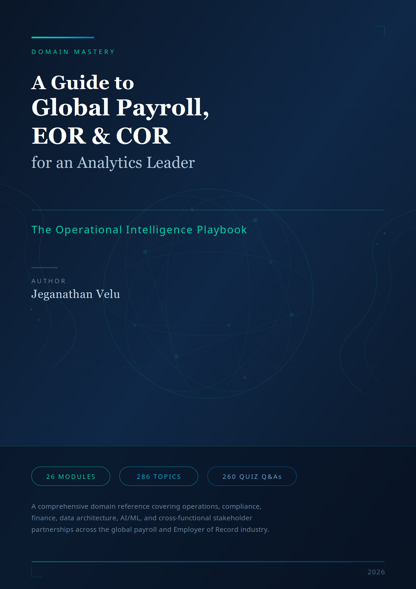

# A Guide to Global Payroll, EOR & COR for an Analytics Leader

  

  
The Operational Intelligence Playbook

  
Jeganathan Velu

  

    26 Modules
    286 Topics
    9 Parts
    9 Appendices
  

---

## About This Book

A comprehensive domain reference covering operations, compliance, finance, data architecture, AI/ML, and cross-functional stakeholder partnerships across the global payroll and Employer of Record industry.

This book is designed for analytics leaders entering or operating within the global payroll, Employer of Record (EOR), and Contractor of Record (COR) space. It provides the operational intelligence foundation needed to become an indispensable partner to every function in the organization.

Each module contains **11 topics** with a consistent structure: What It Is, Why It Matters, Process Flows, Data Artifacts, Controls, Metrics, Failure Modes, AI Opportunities, Discovery Questions, and Exercises — plus a Business ROI topic showing how to quantify the value of analytics in each domain.

Every module concludes with Key Takeaways, a 10-question Quiz with expected answers, a First 90 Days checklist, and a Glossary.

---

## How to Use This Book

**Part I — Core Domain (Modules 1-7)** builds your foundation: operating models, worker lifecycle, payroll engines, treasury, compliance, risk governance, and data platform architecture.

**Part II — Data & Technology (Module 8)** covers master data management — the foundation for analytics quality.

**Part III — Applied Intelligence (Modules 9-10)** applies ML, LangGraph, operational intelligence, and reliability engineering to the domain.

**Parts IV-VII (Modules 11-21)** walk through every major stakeholder function: Product, Customer Experience, Finance, Sales, Marketing, Partners, and Competitive Intelligence.

**Part VIII — Strategy & Transformation (Modules 22-25)** addresses People Analytics, Country Launches, AI Strategy, and Change Management.

**Part IX — Capstone (Module 26)** is your 90-day execution plan as an analytics leader.

**Appendices A-I** provide master references: table of contents, glossary, metrics library, canonical data model, event taxonomy, country reference cards, discovery questions, cross-module reference map, and ROI calculator templates.

---

## Quick Start

- **New to the domain?** Start with Module 1 and work through sequentially.
- **Preparing for interviews?** Focus on Modules 1-6 (core domain) and Module 26 (execution plan).
- **Already in the role?** Jump to the module most relevant to your current challenge.
- **Looking for cross-references?** See Appendix H for a cross-module reference map.
